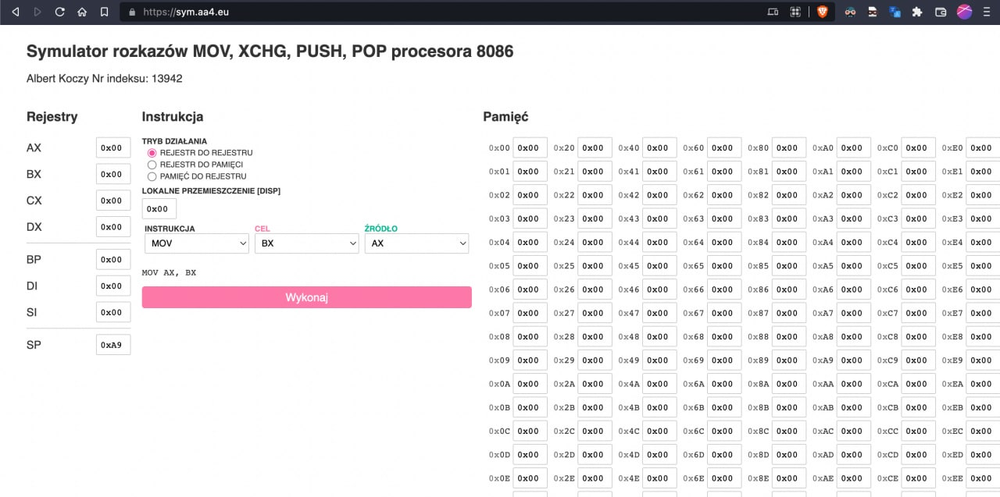

$$ \pagebreak $$

# Opis symulatora

Mój symulator rozkazów procesora 8086 obsługuje kilka rozkazów, które służą do pracy z rejestrami i pamięcią procesora.

- MOV
- XCHG
- PUSH
- POP

Powyższe rozkazy (z wyłączeniem tych dotyczących stosu) obsługują 3 tryby działania i 3 tryby adresowania.

Symulator obsługuje 8 rejestrów i dodatkowo symuluje 256 1-bajtowych komórek pamięci. Obsługuje on również wprowadzenie lokalnego przemieszczenia w instrukcji.s

$$ \pagebreak $$

# Opis obasługiwanych rozkazów

## MOV

Rozkaz `MOV` wykonuje przypisanie wartości z rejestru do rejestru lub z pamięci do rejestru. W przypadku przypisania z rejestru do rejestru instrukcja po prostu kopiuje wartość z rejestru źrodłowego do rejestru docelowego, nadpisując wartość w rejestrze docelowym. 

W trybie kopiowania z rejestru do pamięci (lub vice versa) instrukcja może przypisać wartość z rejestru źrodłowego do pamięci w kilku trybach adresowania. W najprostszym trybie - **bazowym** - adres pamięci na której ma być wykonana operacja jest zdefiniowana przez rejestr `BP`. W trybie **indeksowwym** używany jest rejestr `DI`, a w trybie **indeksowo-bazowym** używana jest suma rejestrów `BP` i `DI`. We wszystkich trybach adresowania do finalnego adresu dodawana jest wartość `DISP`, czyli lokalne przemieszczenie pamięci.

## XCHG

Instrukcja `XCHG` działa analogicznie do MOV, z tym, że zamieniana jest wartość z rejestru do rejestru źrodłowego, a następnie z rejestru docelowego. To oznacza, że żadna wartość n ie jest nadpisywana. Analogicznie do instrukcji `MOV`, `XCHG` może również przypisywać wartość z pamięci do rejestrów i na odwrót.

## PUSH

Instrukcja `PUSH` służy do przeniesienia wartości z rejestru na stos. Instrukcja zaimplementowana jest w taki sposób, że wartość z rejestru źrodłowego jest przenoszona do komórki pamięci wskazywanej przez `SP`, a następnie rejestr `SP` jest zmniejszany o 1, aby zasygnalizować, że została wykorzystana komórka pamięci.

## POP

Instrukcja `POP` służy do przeniesienia wartości z stosu na rejestr. Instrukcja zaimplementowana jest w taki sposób, że wartość z komórki pamięci wskazywanej przez `SP` jest przenoszona do rejestru źrodłowego, a następnie rejestr `SP` jest zwiększany o 1, aby zasygnalizować, że została zwolniona komórka pamięci przeznaczona na stos.

# Interfejs symulatora

Symulator zawiera prosty interfejs graficzny, w formie strony internetowej dostępnej pod adresem:

https://sym.aa4.eu/

Interfejs podzielony jest na 3 sekcje.

## Sekcja rejsestrów

Po prawej stronie interfejsu znajduje się sekcja rejestrów. W niej znajdują się wszystkie rejestry procesora w formie pól tekstowych. Do każdego rejestru można wpisać wartość w systemie szesnastkowym (0-9, A-F), przy czym maksymalna wartość to `0xFF`, czyli 255. Każdy rejestr podświetlany jest odpowiednio na zielono - przy odczycie i na różowo - przy zapisie.

## Sekcja instrukcji 

W sekcji instrukcji użytkownik może wybrać rozkaz, który ma zostać wykonany. Oraz tryb pracy i adresowania. Wszystkie opcje wybiera się z listy, a tryby adresowania są ukryte, jeśli nie są wymagane (praca rejestr <-> rejestr).

Przed wykonaniem instrukcji widzimy ją w formie tekstowej.

## Sekcja pamięci

W sekscji pamięci widzimy wszystkie 256 komórek pamięci wraz z ich adresami. Każdą komórkę można edytować ręcznie jak oraz uzyskiwać dostęp z poziomu instrukcji. Podobnie jak rejestry w sekcji rejestrów, komórki pamięci są podświetlane na zielono - przy odczycie i na różowo - przy zapisie.
